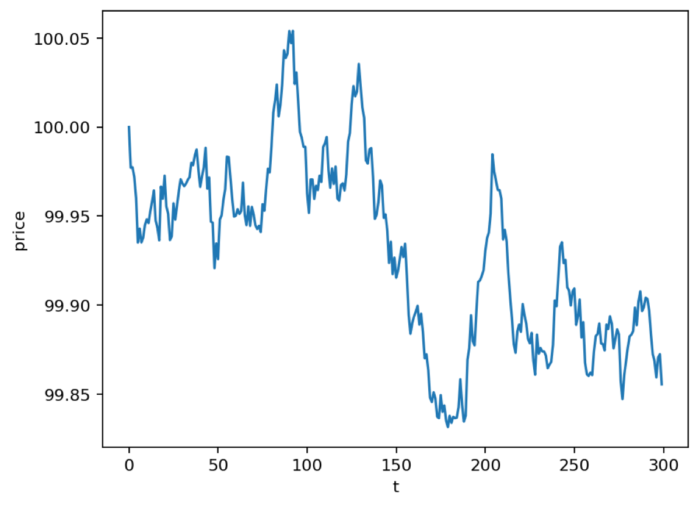
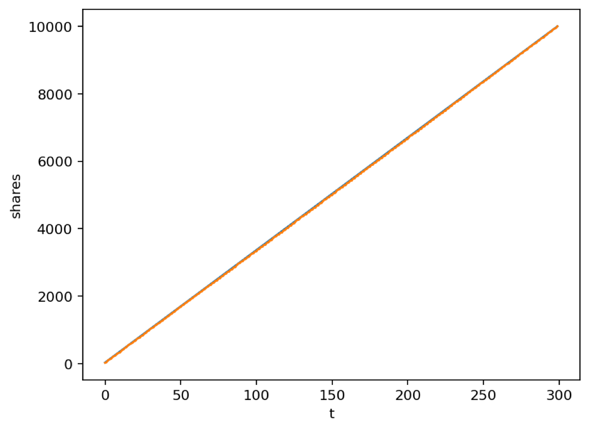
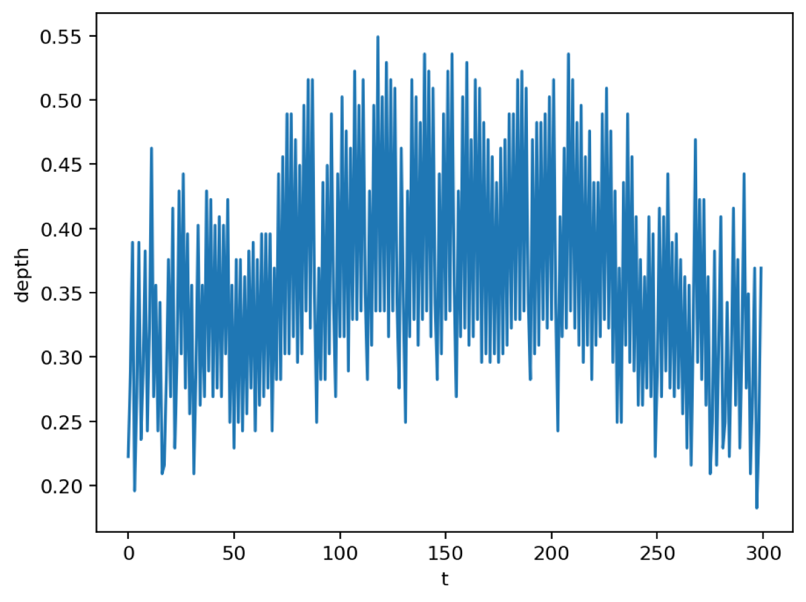

# Optimal Execution with Market and Limit Orders (Python)

This repo implements an intraday execution simulator with order-book microstructure and casts execution as policy optimization. Prices follow a diffusion-like process, aggressive order flow arrives via a Poisson process, and limit-order fills depend on posting depth via an exponential fill model. A parametric policy trades off price improvement from resting bids and progress via market orders under a deviation band from a target schedule. A grid search with vectorized Monte Carlo selects policy hyperparameters.

## Data
Data are synthetic and mimic China A-share microstructure: U-shaped aggressive order arrival intensity over time, discrete ticks, and a one-tick quoted spread.

## Benchmarks
Market-only TWAP and a front-loaded market schedule.

## Quickstart
python -m src.execsim.main

## Outputs
Artifacts are written to `results/`: `grid_search.csv`, `summary.csv`, and PNG plots.
## Sample Results

Click to expand

  
  

  

## Sample Results

Click to expand

  
  

  

